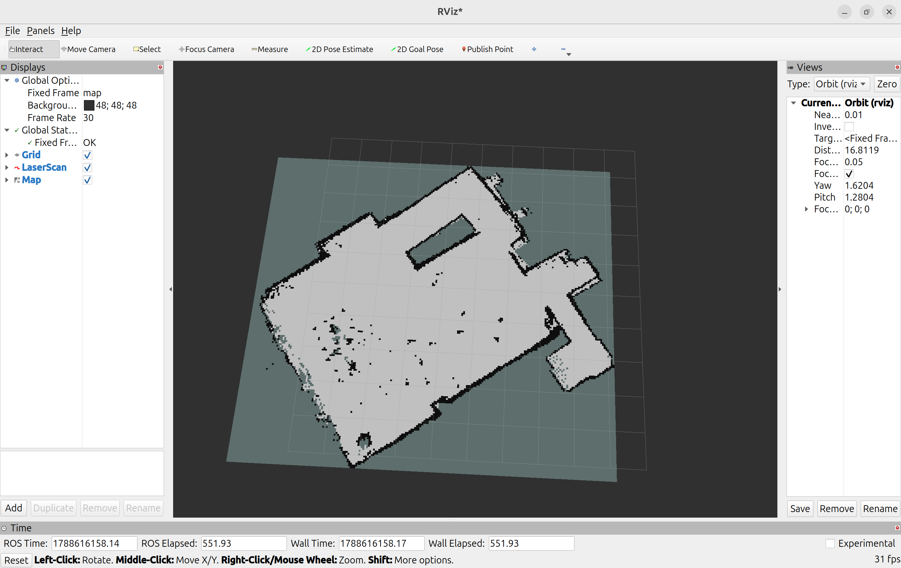
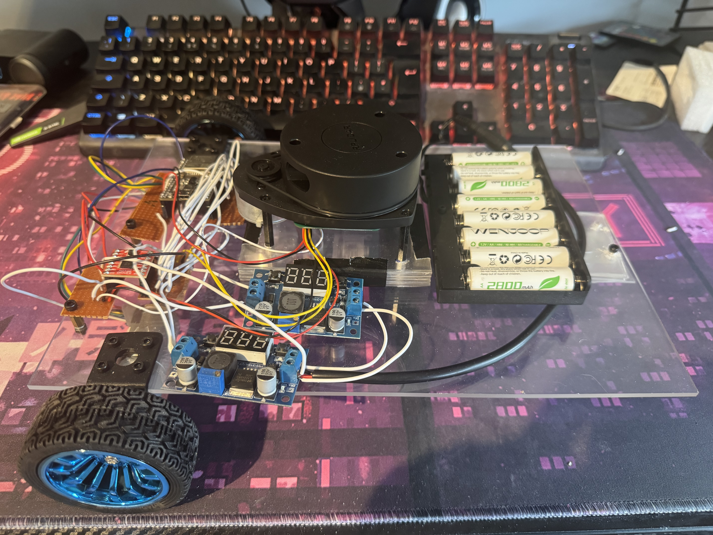

# Laptop-Offloaded LiDAR SLAM Robot

https://github.com/thomasway-sketch/Laptop-offloaded-LIDAR-SLAM-robot/blob/main/assets/RoomMapping.mp4

A differential-drive robot car that maps a room using SLAM and moves autonomously to goals. Nearly all computation runs on a laptop with the robot itself used as a cheap relay connected over WiFi.



## Architecture

The design splits the system across a WiFi link:

**The robot** - It drives the motors, reads the quadrature encoders and relays the LiDAR's raw bytes. No odometry, SLAM or protocol parsing.

**The laptop** - The full ROS2 Jazzy stack. A bridge node translates `/cmd_vel` commands into UDP. The odometry node integrates encoder counts into a pose and broadcasts the `odom→base_link` transform. The slam_toolbox builds the map and Nav2 plans and creates paths.

**Between them** - UDP over WiFi, with the LiDAR's serial stream relayed through a virtual serial port (socat PTY) so the standard `rplidar_ros` driver works unmodified against a sensor that isn't physically attached to the laptop.

This keeps the robot cheap (no single-board computer) and the embedded layer
simple enough to debug, at the cost of a wireless link in the control loop.



## What's mine

Excluding `slam_toolbox`, `Nav2` and the RPLIDAR driver. I developed everything which includes:

- **ESP32 firmware** - LEDC motor PWM, quadrature decoding, thedifferential-drive kinematics, a command watchdog, and a bidirectional LiDAR byte UDP relay.
- **UDP transport** - Commands, telemetry, odometry and LiDAR channels.
- **Odometry node** - Encoder counts to the pose `nav_msgs/Odometry` and the `odom→base_link` transform.
- **LiDAR relay** - raw serial over WiFi, bridged to a virtual serial port so the
  stock driver can talk to it.
- **Bringup** - launch files, Nav2 and slam_toolbox configuration.

## Hardware

| Component | Part |
| MCU | ESP32-WROOM-32E |
| Motors | 2× JGA25-371 with Hall quadrature encoders |
| Driver | SparkFun TB6612FNG |
| LiDAR | Slamtec RPLIDAR A1M8 |
| Power | 8×AA NiMH (9.6 V) via two LM2596 buck converters |
| Chassis | Custom 3 mm acrylic deck,multiple 1mm sheets used where needed and velcro  |


## Running it

```bash
./StartUp.sh                    # opens socat, bridge, odometry, LiDAR driver, transform
ros2 launch slam_toolbox online_async_launch.py use_sim_time:=false \
  slam_params_file:=<...>       # for mapping
```

## Build log

The interesting part of this project was the debugging. [`docs/build-log.md`](docs/BuildLog.md)
is a date-stamped account of what broke and how it was diagnosed. From a Bytes being skipped over my UDP relay, to a ground wire soldered into a PWM input that made the robot work tethered and fail on battery, to a QoS mismatch which caused my completely working map to become invisible.

## Next

A camera-based object detection layer feeding a custom Nav2 costmap plugin, for
semantic navigation — giving people wider clearance, avoiding object classes the
2D LiDAR can't distinguish.
